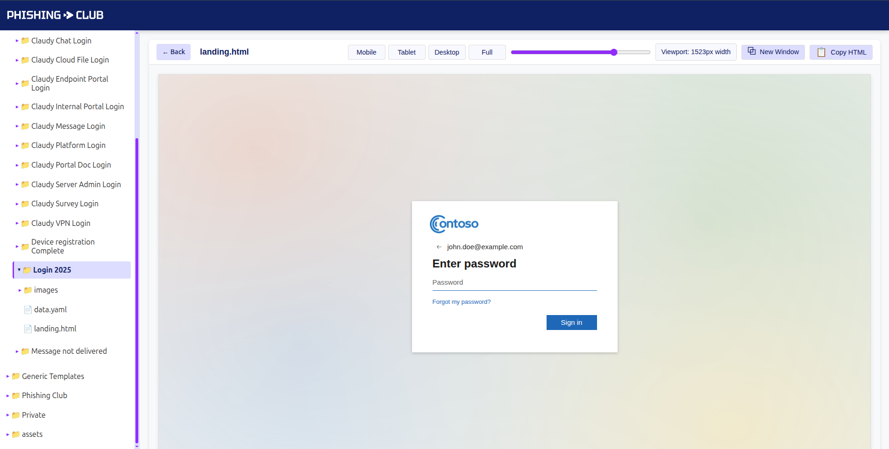

# Phishing Template Workbench

**Developer-Focused Phishing Template Development Environment**



This tool enhances the development workflow for security professionals creating phishing simulation templates. It provides an preview environment where developers can:

- **Preview Templates**: View how templates render with test data
- **Variable Substitution**: See template variables like `{{.BaseURL}}`, `{{.Email}}`, `{{.FirstName}}` automatically populated with sample values
- **Naive Responsive Testing**: Preview templates across different device sizes (mobile, tablet, desktop)
- **Naive Email Testing**: Check emails templates in Mailpit and check HTML/CSS scores with different email clients and SpamAssassin score.
- **Asset Management**: Automatically resolve template assets with intelligent fallback to global asset directories
- **Quick Iteration**: Copy processed HTML, download template folders, and export entire template collections

Compatible with [Phishing Club](https://github.com/phishingclub/phishingclub) and GoPhish.

## Just give me some templates

While this tool is for editing and checking templates, sometimes you just want quick templates to import
into Phishing Club. On the [Releases page](https://github.com/phishingclub/templates/releases) you can download a .zip with the templates which can be imported via the Settings page in Phishing Club.

Most templates require a little editing..

*Remember to change the sender on emails.*


## ⚠️ Security Warning

**This application is meant ONLY for local development use. Never expose it publicly.**

It is build upon AI 🤖 slop, so keep it local

## Quick Start

1. **Clone and Start**
   ```bash
   git clone https://github.com/phishingclub/templates.git
   cd templates
   make up
   # or manually:
   docker-compose up --build
   ```

2. **Preview and start creating**
   - Open `http://localhost:8005`
   - Check out the templates and data.yml files
   - Start editing or creating new phishing templates!

## Installation Options

### Option 1: Docker Compose with Makefile (Recommended)

```bash
git clone https://github.com/phishingclub/templates.git
cd templates
make up
```

### Option 2: Local Go Installation (no mailpit/spamassassin)

```bash
git clone https://github.com/phishingclub/templates.git
cd templates
go build
./templates
```

**Options:**
- `-port 8080` - Change server port (default: 8080)
- `-templates ./my-templates` - Specify templates directory
- `--export` - Export all templates to ZIP and exit

## Naive Email Testing

Emails templates with a correct `data.yml` can be sent to a local mailpit container.

Mailpit is setup with an awesome HTML check feature that lets you know how supported the HTML/CSS is in
different mail clients AND a Spam analysis via. its Spamassassin integration.

The Spamassassin rule config has been adjusted slightly to avoid spam scores that are not relevant
when previewing.

Check it out by opening a email templates, click the `Send Test Email` and open mailpit by clicking the 📬 icon.

## Services and Ports

| Port | Service | Description |
|------|---------|-------------|
| 8005 | Templates | Template workbench web interface |
| 8102 | Mailpit | Email testing web interface with SpamAssassin integration |
| 1025 | SMTP | Internal SMTP server (not exposed publicly) |

All services run in Docker containers and are only accessible locally during development.

## Development Commands

The project includes a comprehensive Makefile for common development tasks:

## Template Structure

### Basic Structure
```
phishing-templates/
├── assets/                    # Global generic assets (available to all templates)
│   ├── images/
│   │   └── common-icons.png
│   └── css/
│       └── shared-styles.css
├── private/                   # Client-specific templates (DO NOT COMMIT)
│   └── client-company/
│       ├── data.yaml
│       └── branded-campaign/
│           ├── email.html
│           └── assets/
│               └── client-logo.png
└── generic-service/           # Generic templates safe to commit
    ├── data.yaml             # Template metadata (required)
    └── login-alert/
        ├── email.html        # Email template
        ├── landing.html      # Landing page (optional)
        └── assets/           # Template-specific assets
            └── generic-logo.png
```

### data.yaml
Each template should contain a `data.yaml`, the file contains data that is used
when importing the template into Phishing Club.

By default all templates should be named Template - Name so they can be easily copied and used. When an import happens it will overwrite any existing templates with the same name. This includes the assets.


```yaml
emails:
  - name: "Generic Service - Login Alert"
    file: "email.html"
    envelope_from: "security@service.com"
    from: "IT Security <security@service.com>"
    subject: "Unusual Login Activity Detected"

landing_pages:
  - name: "Generic Service Login Page"
    file: "landing.html"
```

## Template Variables

Template variables are automatically populated with test data during preview:

### Recipient Data
| Variable | Example Value | Description |
|----------|---------------|-------------|
| `{{.rID}}` | `1234567890` | Recipient record ID |
| `{{.FirstName}}` | `John` | Recipient's first name |
| `{{.LastName}}` | `Doe` | Recipient's last name |
| `{{.Email}}` | `john.doe@example.com` | Recipient's email address |
| `{{.To}}` | `john.doe@example.com` | Alias for Email |
| `{{.Phone}}` | `+1-555-123-4567` | Phone number |
| `{{.ExtraIdentifier}}` | `EMP001` | Additional identifier |
| `{{.Position}}` | `IT Manager` | Job position |
| `{{.Department}}` | `Information Technology` | Department |
| `{{.City}}` | `New York` | City |
| `{{.Country}}` | `United States` | Country |
| `{{.Misc}}` | `Additional Info` | Miscellaneous data |

### Tracking & URLs
| Variable | Example Value | Description |
|----------|---------------|-------------|
| `{{.URL}}` | `https://example.com/phishing-link` | Phishing URL |
| `{{.BaseURL}}` | `/templates/company/campaign` | Base URL for assets |
| `{{.Tracker}}` | HTML tracking pixel | Email open tracking image |
| `{{.TrackingURL}}` | `https://track.example.com/clicked/id` | Link click tracking URL |

### Sender Information
| Variable | Example Value | Description |
|----------|---------------|-------------|
| `{{.From}}` | `Security Team <security@company.com>` | Sender address |

### API Sender Fields
| Variable | Example Value | Description |
|----------|---------------|-------------|
| `{{.APIKey}}` | _(empty)_ | API key |
| `{{.CustomField1}}` | _(empty)_ | Custom field 1 |
| `{{.CustomField2}}` | _(empty)_ | Custom field 2 |
| `{{.CustomField3}}` | _(empty)_ | Custom field 3 |
| `{{.CustomField4}}` | _(empty)_ | Custom field 4 |

## Template Functions

The template system supports the same functions as the Phishing Club platform:

### Text Processing
| Function | Example | Description |
|----------|---------|-------------|
| `{{urlEscape "hello world"}}` | `hello%20world` | URL encode a string |
| `{{htmlEscape "<script>"}}` | `&lt;script&gt;` | HTML escape a string |
| `{{base64 "hello"}}` | `aGVsbG8=` | Base64 encode a string |

### Random Generation
| Function | Example | Description |
|----------|---------|-------------|
| `{{randInt 1 10}}` | `7` | Random integer between 1 and 10 (inclusive) |
| `{{randAlpha 8}}` | `AbCdEfGh` | Random alphabetic string of specified length |

### Date & Time
| Function | Example | Description |
|----------|---------|-------------|
| `{{date "Y-m-d"}}` | `2025-01-15` | Current date in specified format |
| `{{date "Y-m-d H:i:s"}}` | `2024-05-15 14:30:25` | Current date and time |
| `{{date "Y-m-d H:i:s" 3600}}` | `2024-05-15 15:30:25` | Date with offset (3600 seconds = 1 hour) |

**Date Format Codes:**
- `Y` - 4-digit year (2024)
- `y` - 2-digit year (24)
- `m` - 2-digit month (01-12)
- `n` - Month without leading zero (1-12)
- `M` - Short month name (Jan, Feb)
- `F` - Full month name (January, February)
- `d` - 2-digit day (01-31)
- `j` - Day without leading zero (1-31)
- `H` - 24-hour format hour (00-23)
- `h` - 12-hour format hour (01-12)
- `i` - Minutes (00-59)
- `s` - Seconds (00-59)
- `A` - Uppercase AM/PM
- `a` - Lowercase am/pm

### QR Codes
| Function | Example | Description |
|----------|---------|-------------|
| `{{qr .URL }}` | HTML table QR code | Generate QR code as HTML |
| `{{qr .URL 6}}` | Larger QR code | QR code with custom dot size |

**Example Usage:**
```html
<p>Hello {{.FirstName}}, today is {{date "F j, Y"}}!</p>
<p>Your confirmation code is: {{randAlpha 6}}</p>
<p>Lucky number: {{randInt 1 100}}</p>
<div>{{qr .URL 8}}</div>
```

## Included Examples

This repository comes with a collection of phishing example templates:

Any example requires modification before use.

Use the `Export All` and import them into Phishing Club.


### Global Assets
Place shared assets in the `assets/` directory:
```
assets/
├── images/
│   ├── generic-icons.png
│   └── security-symbols/
└── css/
    └── email-base.css
```

Use in templates: `{{.BaseURL}}/images/generic-icons.png`

### Template-Specific Assets
Place template-specific assets in the template's directory:
```
generic-service/campaign/
├── email.html
└── assets/
    └── campaign-banner.png
```

Use in templates: `{{.BaseURL}}/assets/campaign-banner.png`

The system automatically falls back to global assets if local assets aren't found.

## Features

### Preview Controls
- **Device Presets**: Mobile (375×812), Tablet (768×1024), Desktop (1366×768), Full viewport
- **Custom Width**: Use the slider to test any width from 320px to 1920px
- **Copy HTML**: Get the processed HTML with variables replaced
- **New Window**: Open template in a new tab for testing

### Export & Download
- **Export All**: Download all templates and assets in GoPhish/Phishing Club format
- **Download Folders**: Download individual template directories
- **Structured Output**: Organized ZIP files ready for import

### Development Workflow
1. Create generic templates in `phishing-templates/`
2. Put client-specific templates in `private/` (never commit)
3. Edit templates in your favorite IDE
4. Save changes (auto-reload in Docker)
5. Preview in browser
5.5. If email, send to mailpit and check html/css/spam scores
6. Test across different devices and email clients
7. Copy processed HTML for testing
8. Export when ready for deployment

### WHAT ABOUT AI?!
Creating emails and templates with AI is super easy and it should be part of the developer experience using your favorite editor or IDE. Simply choose your favorite code editor with AI support and get started.

We might consider a pull request for a folder filled with good custom rules to feed the agents.

## Best Practices

### 1. Keep Templates Generic and Secure
- **Never commit company names or branded assets** to the main templates directory
- Use the `private/` folder for client-specific templates and assets
- Keep all templates in `phishing-templates/` as generic examples
- Use placeholder names like "Generic Service", "Example Corp", or "Your Organization"
- Replace specific branding with generic equivalents before committing

**Example Structure:**
```
phishing-templates/
├── generic-bank/           ✅ Safe to commit
│   └── login-alert/
├── example-cloud/          ✅ Safe to commit
│   └── security-notice/
└── private/                ❌ DO NOT COMMIT
    ├── actual-client/
    └── real-company/
```

### 2. Email HTML/CSS Limitations
Emails are not websites. Understanding email client limitations is crucial.

**Recommended Resources:**
- [Can I Email](https://www.caniemail.com/) - CSS support across email clients
- [Email on Acid](https://www.emailonacid.com/blog/article/email-development/) - Best practices
- [Litmus](https://litmus.com/blog/a-guide-to-bulletproof-buttons-in-email-design/) - Email development guides

### 3. Progressive Enhancement Testing Strategy
Test from the worst email client up to ensure broad compatibility:

1. **Start with the worst**: Test in Outlook (Classic) 2016/2019 (Windows)
2. **Move to mobile**: Apple Mail (iOS), Gmail (Android)
3. **Web clients**: Gmail (Web), Outlook (Web), Yahoo Mail
4. **Modern clients**: Apple Mail (macOS), Thunderbird

**Testing Workflow:**
- Design for Outlook Classic very limited rendering engine first
- Enhance progressively for better clients
- Always test with images disabled
- Verify dark mode compatibility
- Test forwarding behavior (styles often get stripped)

**Key Testing Points:**
- Button rendering across clients
- Font fallbacks when custom fonts fail
- Layout integrity without images
- Text readability in dark mode
- Mobile responsiveness (especially Gmail mobile)

## Restrictions

The following directory names are reserved and cannot be used in the root template folder:
- `api`
- `preview`
- `raw`
- `static`
- `private` (recommended for client-specific content)

## Template Inspiration

There is a lot of excellent starting points and examples for email templates:
- [Mailgun Transactional Templates](https://github.com/mailgun/transactional-email-templates/)
- [SendGrid Email Templates](https://github.com/sendgrid/email-templates)
- [Konsav Email Templates](https://github.com/konsav/email-templates/)
- [ColorlibHQ Email Templates](https://github.com/ColorlibHQ/email-templates)
- [MailPace Templates](https://github.com/mailpace/templates)
- [Cerberus Email Templates](https://github.com/emailmonday/Cerberus)
- [EmailOctopus Templates](https://github.com/threeheartsdigital/emailoctopus-templates)

## Contributing

Contributions welcome for:
- New template formats
- Enhanced preview features
- Bug fixes and improvements

Do not make pull requests with Microsoft, Facebook or similar, instead use a ficticous name and logo that can be replaced.

## Disclaimer

**This tool is intended for authorized security testing and awareness training only. Users are responsible for ensuring compliance with applicable laws and organizational policies.**
